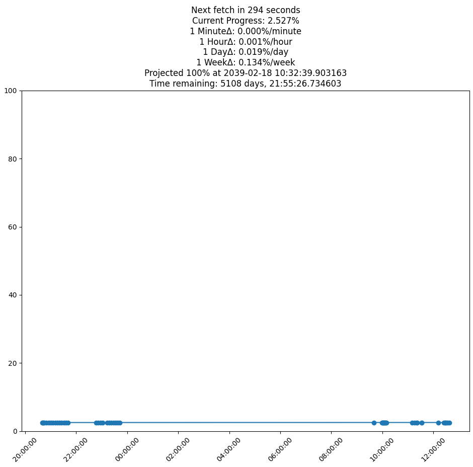

# StrikePlotter

This is a Frankenstein unholy marriage of Docker and Python that logs and live plots progress from [https://generalstrikeus.com/](https://generalstrikeus.com/) while also providing a live forecast of the expected completion date.



## Features
- **Data Fetching**: The program uses Puppeteer within a Docker container to scrape progress data from [https://generalstrikeus.com/](https://generalstrikeus.com/).
- **Logging**: It logs the fetched progress percentage with timestamps in a `progress.log` file.
- **Live Plotting**: Displays a real-time plot of progress over time via Matplotlib, updating every few seconds.
- **Progress Projection**: Calculates and displays the projected time when progress will reach 100% based on the current trend.
- **Slope Calculation**: Calculates the rate of change of progress (slope) in percentage per minute.

## Prerequisites
- Python 3.6+ and pip
- Docker

## Getting Started
1. Clone the repo.
2. Install Docker, Python 3, and the required Python packages:
   ```bash
   python3 -m pip install -r requirements.pip3
3. Run the bastard:
```
python3 StrikePlotter.py
```

